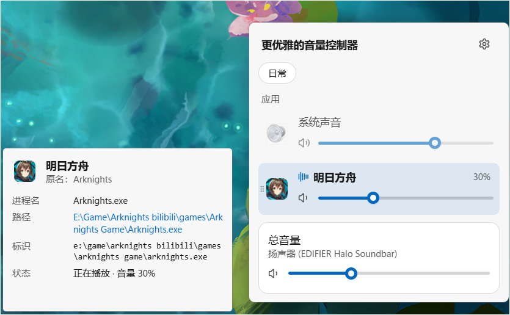
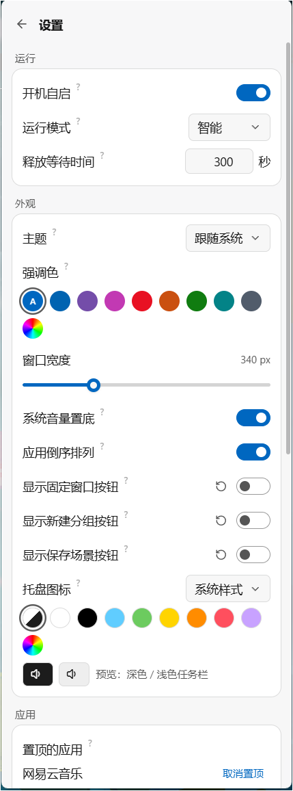

# 更优雅的音量控制器

面向 Windows 11 的轻量级托盘音量控制工具。点击托盘图标，一眼看到所有正在使用声音的应用，逐个调节音量；外观贴近 Windows 11（Mica 背景、跟随系统深浅色与强调色）。

<!-- 截图在 assets/screenshots/ 下，替换同名文件即可更新。 -->
<p align="center">
  
  
  
</p>

## 功能

**音量控制**

- 系统总音量与每个应用的音量、静音；在系统音量合成器或其他程序里修改的音量会实时同步。
- 同一程序的多个音频会话合并为一行显示，名称与图标取自程序本身（UWP 应用同样支持）。
- 滚轮在窗口内任意一行上调节音量；点击百分比数字可直接输入音量（↑ / ↓ 微调，Esc 取消）。
- 切换默认输出设备后列表自动刷新。

**应用管理**

- 置顶、隐藏、重命名应用（右键菜单）；拖动左侧手柄或图标可排序、加入分组。
- 分组：多个应用一起调节，组音量按比例缩放。
- 音量场景：把当前各应用音量保存为“游戏 / 会议 / 音乐”等场景，一键切换。
- 应用详情：点击应用行，在窗口旁显示进程名、路径、标识等；文字可复制，点击路径打开所在文件夹。

**托盘与任务栏**

- 托盘图标随音量和静音状态变化，提供多种样式和颜色（默认跟随任务栏深浅色）。
- 在托盘图标上滚动滚轮调节系统音量，中键静音；也可开启“在任务栏任意位置滚动调节”。
- 可选调节提示音与 Windows 自带的音量浮层。

**窗口与运行**

- 窗口从托盘处滑入，失焦自动收起；可固定窗口或固定并置顶。
- 三种运行模式：
  - **智能**（默认）：隐藏一段时间后释放界面，兼顾打开速度和内存。
  - **常驻**：界面始终保留，打开最快。
  - **静默**：隐藏即释放界面，后台只占几 MB 内存。
- 开机自启（首次运行时询问）、单实例运行。

## 系统要求

- Windows 11（x64）。Windows 10 未测试。
- WebView2 Runtime（Windows 11 自带）。

## 使用

运行 `win11-volume-mixer.exe` 后程序驻留在托盘：

| 操作 | 效果 |
| --- | --- |
| 左键点击托盘图标 | 打开 / 收起窗口 |
| 托盘图标上滚动滚轮 | 调节系统音量 |
| 中键点击托盘图标 | 系统静音 / 取消静音 |
| 右键点击托盘图标 | 托盘菜单（打开、静音、退出） |
| 窗口内右键应用 | 复制名称或路径、置顶、分组、隐藏、重命名 |
| 点击应用行 | 显示 / 隐藏应用详情 |

设置保存在程序所在目录的 `settings.json`，便于备份和随程序移动；程序目录不可写时（如安装到 Program Files）改存到 `%APPDATA%\com.floooint.volumemixer\`。

## 从源码构建

需要 Node.js 24、pnpm 12、Rust stable（`x86_64-pc-windows-msvc`）以及 Visual Studio Build Tools（C++ 工作负载）。详细的环境安装步骤和版本见 [agent.md](agent.md)。

```text
pnpm install
pnpm tauri dev                  # 开发模式
pnpm tauri build                # 构建 exe 和 NSIS 安装包
pnpm tauri build --no-bundle    # 只构建 exe
```

构建产物在 `src-tauri/target/release/`：`win11-volume-mixer.exe`，安装包在 `bundle/nsis/`。

测试与检查：

```text
cd src-tauri
cargo test      # Rust 单元测试（同时重新生成 src/bindings.ts）
cargo clippy
cd ..
pnpm typecheck
```

调试用环境变量：

- `VOLUME_MIXER_SETTINGS=<路径>`：使用指定的设置文件，不影响真实设置。
- `VOLUME_MIXER_WINDOW=resident|silent|smart`：临时覆盖运行模式，不写入设置。

## 技术栈

Tauri 2、React 19、TypeScript、Tailwind CSS 4、Motion、Zustand；后端为 Rust，通过 windows-rs 调用 Windows Core Audio（WASAPI）。界面组件来自 [Animate UI](https://animate-ui.com) 与 Radix UI；前后端类型由 tauri-specta 自动生成。

## 文档

- [开发环境与规范](agent.md)

## 许可证

本项目代码以 [MIT 许可证](LICENSE) 发布。

例外：`src/components/animate-ui/` 和 `src/hooks/use-is-in-view.tsx` 来自 [Animate UI](https://animate-ui.com)，适用其 MIT + Commons Clause 许可证（见 [src/components/animate-ui/LICENSE.md](src/components/animate-ui/LICENSE.md)）：可以作为本程序的一部分使用和分发，但不能单独出售或再分发这些组件本身。shadcn/ui 与 Radix UI 为 MIT 许可证。
